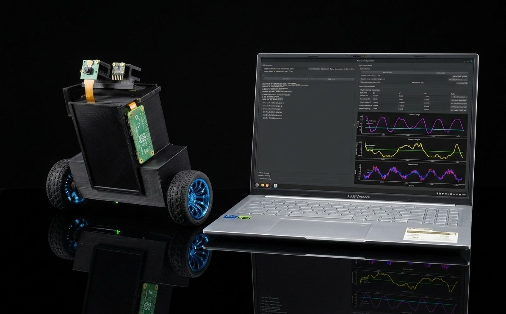

# Self-Balancing Robot

  

The purpose of this project was to implement the complete **control system** for a **self-balancing robot** using **Zephyr RTOS**. 

## Supported features
- various **drivers** allowing to interact with used **sensors and actuators**,
- control loop allowing the robot to: **balance**, **drive** and **rotate** - **setpoints changeable** by the user,
- communication scheme involving the **BLE** protocol, allowing the user to control the **application flow** through a set of commands,
- integration of the **RPI Zero 2W** platform allowing for hosting a **web-server**, providing an advanced **user interface**,
- **DFU** (*Device Firmware Update*) over **BLE** managed by the **RPI** on user command - with the use of the **Newtmgr** tool,
- **manual** robot driving with a smartphone acting as a **steering wheel**,
- **camera display capture** allowing for visualizing robot POV in real-time on the server.

## Further plans
- robot mathematical model **parameters identification** - for **simulation**, control loop **tuning** and **model based controllers** (e.g. LQR),
- **intelligent controllers** usage, e.g. a neural controller,
- **"swing-up"** like procedure,
- camera image usage for **robot's self-driving**.

## Licensing

- Software and firmware: **Apache License 2.0**
- Hardware designs (schematics, PCB, CAD): **CERN-OHL-P-2.0**

Commercial use is allowed.

