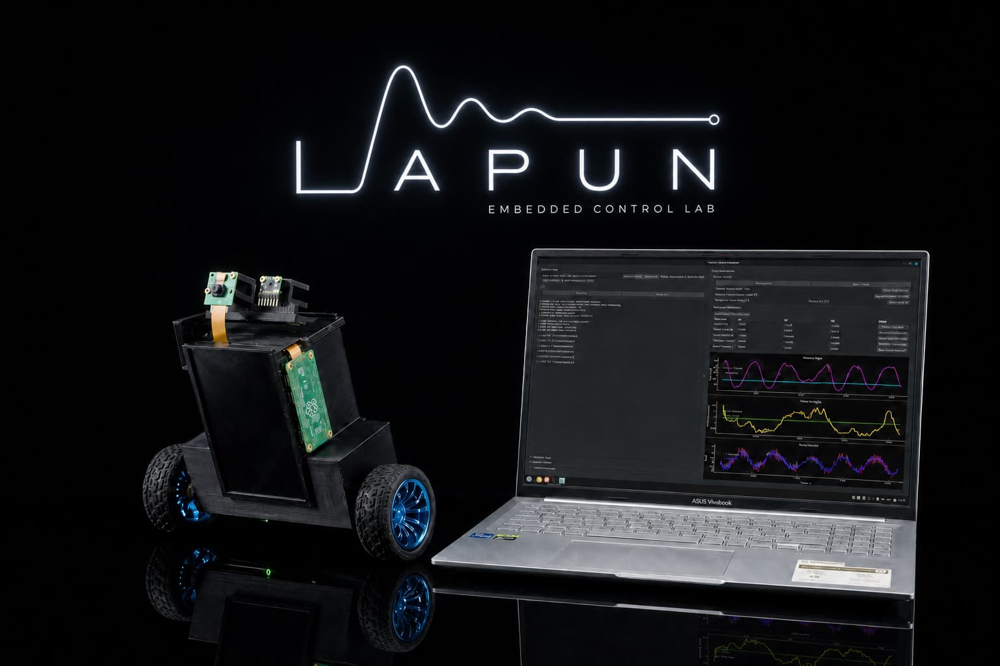
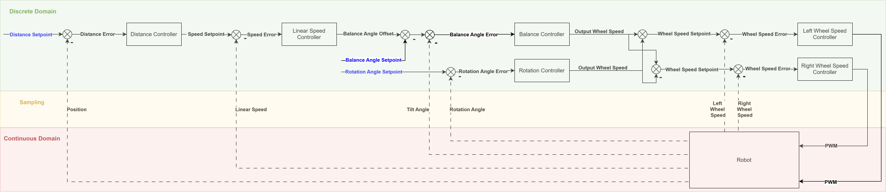

# Self-Balancing Robot

<p align="center">
  
</p>

A two-wheeled self-balancing robot built around the **Nordic nRF52840** and
**Zephyr RTOS**, using **nRF Connect SDK 2.8.0**. The project includes the
embedded control system, custom electronics and mechanical designs, a BLE
desktop application, over-the-air firmware updates, and tools for modelling
and controller development.

## Demonstration

https://github.com/user-attachments/assets/bdc0d3e3-bf6b-4125-bade-0684ad42b085

## Features

### Robot firmware

- Cascaded control loop for balancing, driving, and rotation
- PID controllers with user-adjustable setpoints and parameters
- Optional LQR balance controller
- Trajectory generation for linear motion and rotation
- MPU6050 inertial measurement and quadrature encoder feedback
- PWM motor control for dual TB6612FNG drivers
- Battery-voltage monitoring
- Safety angle validation and controlled motor shutdown
- Binary BLE protocol for commands, telemetry, and diagnostic logs
- MCUboot-based device firmware update over BLE

### Control and development tools

- PyQt6 desktop application for BLE control, live telemetry, PID tuning, and DFU
- Offline model identification and LQR tuning tools
- MATLAB/Simulink models of the inverted-pendulum system
- Optional Raspberry Pi Zero 2 W web interface with camera streaming
- KiCad schematics, PCB layout, Gerber files, and mechanical CAD

> [!NOTE]
> The Raspberry Pi web interface and the nRF7002 DK controller are legacy or
> experimental components and may require adaptation to the current binary BLE
> protocol.

## Control architecture

The firmware uses a cascaded control structure. Distance and linear-speed
controllers generate the balance-angle setpoint, while the balance and
rotation controllers determine the wheel-speed setpoints. Separate wheel
controllers then generate the motor PWM outputs.



The default configuration uses PID control. LQR can be selected at build time,
and the on-device model-identification mode is available as an optional
configuration.

## Hardware

The robot is based on:

- Nordic nRF52840 Dongle
- MPU6050 IMU
- Two DC gearmotors with quadrature encoders
- Two TB6612FNG motor drivers
- 2-cell, 7.4 V LiPo battery
- Custom PCB and 3D-printed mechanical structure
- Optional Raspberry Pi Zero 2 W and CSI camera

Hardware design files are available in [`Schematic/`](Schematic/).

## Getting started

### Prerequisites

- [nRF Connect SDK 2.8.0](https://developer.nordicsemi.com/nRF_Connect_SDK/doc/2.8.0/nrf/index.html)
- nRF Connect toolchain 2.8.0
- West and the Zephyr development environment
- An SWD debugger for the initial firmware installation

See the detailed [environment setup guide](docs/environment_setup.md) before
building the project.

### Build the robot firmware

From the repository root:

```bash
cd Sources/applications/app
west build -b nrf52840dongle_nrf52840 -p
```

The resulting DFU package is generated at:

```text
Sources/applications/app/build/dfu_application.zip
```

For additional information, see
[Building and flashing](docs/building_and_running_fw.md).

### Flash the initial firmware

After connecting an external SWD debugger:

```bash
cd Sources/applications/app
west flash --erase --skip-rebuild
```

Subsequent firmware versions can be installed over BLE using the desktop
application and the generated DFU package.

### Run the desktop application

The application requires Python 3, PyQt6, and Bleak:

```bash
python3 -m pip install PyQt6 bleak
python3 run_controller_app.py
```

The DFU workflow additionally requires
[`smpmgr`](https://github.com/intercreate/smpmgr). A Windows binary is included
in [`3rdParty/smpmgr/`](3rdParty/smpmgr/); on Linux, `smpmgr` must be available
on `PATH`.

## Repository structure

```text
.
├── Sources/applications/app/          # Main nRF52840 robot firmware
├── Sources/applications/controller/   # Experimental nRF7002 DK controller
├── Sources/applications/controller_rpi/
│                                      # Raspberry Pi web interface
├── Sources/drivers/                   # IMU, encoders, motors, BLE, DFU, battery
├── Sources/robot_control/             # Control loop, PID, LQR, state machines
├── robot_control_app/                 # PyQt6 BLE desktop application
├── mathematical_model/                # Models, identification, and LQR tooling
├── Schematic/                         # PCB, schematics, Gerbers, and CAD
├── docs/                              # Setup and build documentation
└── dts/bindings/                      # Custom Zephyr devicetree bindings
```

## Documentation

- [BLE protocol](Sources/drivers/bluetooth/README.md)
- [Control-loop structure](Sources/robot_control/docs/control_loop.md)
- [Application state machine](Sources/robot_control/docs/application_state_machine.md)
- [Mathematical model](mathematical_model/doc/model.md)
- [Environment setup](docs/environment_setup.md)
- [Building and flashing](docs/building_and_running_fw.md)

## Roadmap

- Swing-up procedure
- Neural and other intelligent controllers
- Vision-based autonomous navigation

## Licensing

- Software and firmware: [Apache License 2.0](LICENSE)
- Hardware designs (schematics, PCB, and CAD):
  [CERN-OHL-P-2.0](Schematic/LICENSE)

Commercial use is permitted under the terms of the respective licenses.
