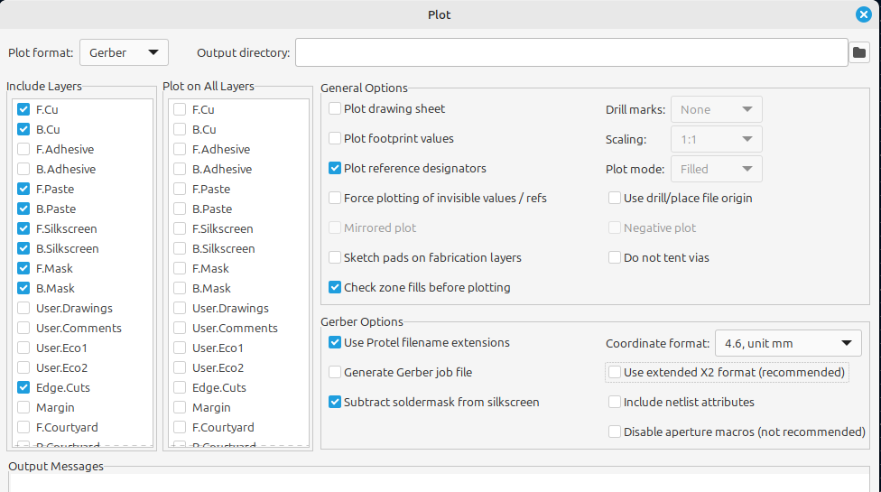
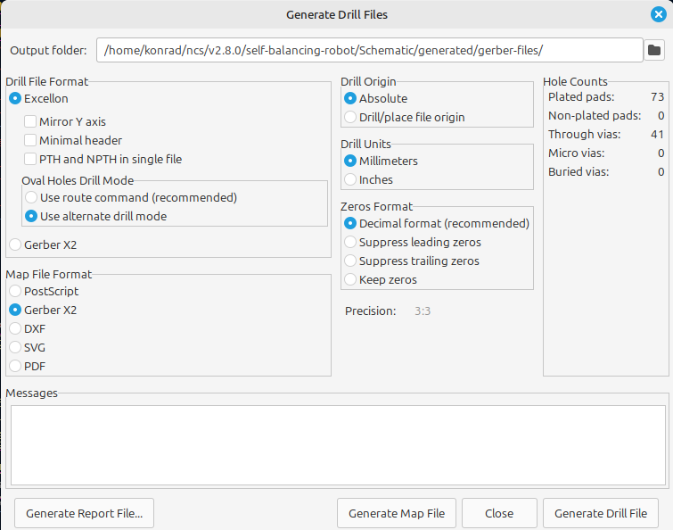
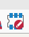

## License

This project is licensed under the **CERN Open Hardware Licence Version 2 - Permissive (CERN-OHL-P)**. 

The license covers all design files in this directory, including:
* **Electronics:** KiCad schematics, PCB layouts, and libraries.
*  **Mechanics:** Physical case design (Fusion 360 files in the `robot-case` directory).

Copyright © 2026 Dymczyk Filip and Konrad Grucel

# **Project Based on KiCad 7.0**

## **Generating Gerber Files**

To generate new Gerber files after making changes to the schematic, follow [this guide](https://jlcpcb.com/help/article/how-to-generate-gerber-and-drill-files-in-kicad-7).

### **Quick Guide**

1. Open the PCB editor.
2. Click **File → Fabrication Outputs → Gerber Files (.gbr)**.
3. Your configuration should look like the following image:

4. Click **Plot**, and the files will be saved in your selected output directory.

For drill files **.drl**, follow these steps:

1. Configure settings as shown below:

1. Click **Generate Drill Files**, then **Generate Map Files**.
2. The files will be saved in your selected output directory.

**Adding Custom Symbols, Footprints, and 3D Models**

### **Sources for Custom Components**

You can find various custom symbols, footprints, and 3D models online. Recommended sources:

- [GrabCAD](https://grabcad.com/library/lm2596-module-for-kicad-1)
- [SnapEDA](https://www.snapeda.com/parts/GY-521/GODREAM FORDREAM CO., LIMITED/view-part)

All external symbols, footprints, and 3D models used in this project are located in the `external-3d-models` and `external-symbols-footprints` directories. The sources for these components are documented in `utils/external-parts-Kicad.txt`.

### **Adding Symbols and Footprints**

#### **1. Download the Files**

Example files from [SnapEDA](https://www.snapeda.com/parts/GY-521/GODREAM FORDREAM CO., LIMITED/view-part):

- **Symbol:** `.kicad_sym`
- **Footprint:** `.kicad_mod`

#### **2. Adding a Symbol**

1. Open the KiCad schematic editor.
2. Click **Preferences → Manage Symbol Libraries**.
3. Click the folder icon and provide the path to the `.kicad_sym` file.

#### **3. Adding a Footprint**

1. Open the KiCad schematic editor.

2. click the following icon

   

   

3. Click **Preferences → Manage footprints Libraries**,  and provide an path to the `.kicad_mod` file

next you have to click `Preferences button` button and then `Manage footprints liblaries`

then you have to click `directory(folder)` icon and provide a path to your `.kicad_mod` file.

**note: ** the `kicad_mod` and `kicad_sym` files can be in the same directory. if you download footprint and symbol package.

## **Adding 3D Models**

1. Download a 3D model, for example, from [GrabCAD](https://grabcad.com/library/mpu-6050-imu-sensor-1).
2. Place the corresponding symbol in the schematic.
3. Open the PCB editor and click **Tools → Update PCB from Schematic**.
4. Once the component appears, double-click it.
5. Navigate to the **3D Models** tab and provide the path to the `.wrl` or `.step` file.
