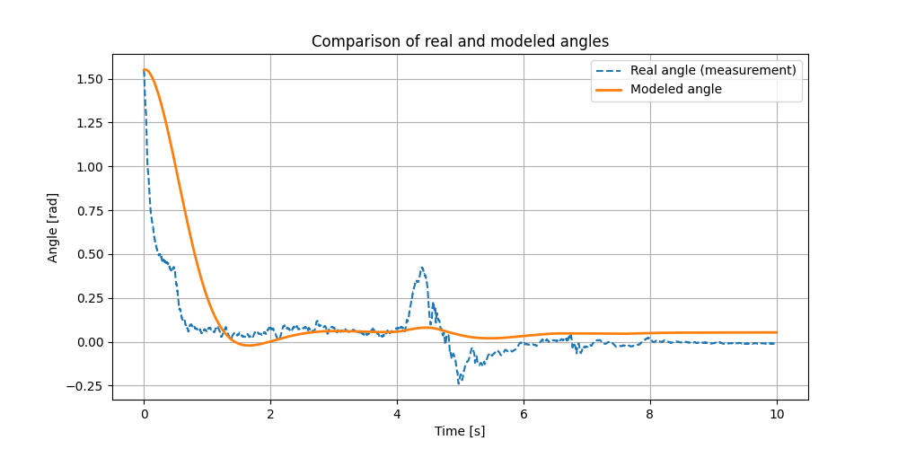

# Inverted Pendulum Parameter Identification and Transfer Function Derivation

## Project Description

The goal of this project is to identify the parameters of the **inverted pendulum model** (a two-wheeled balancing robot) and derive the transfer function of the system based on experimental data.

## Equation of Motion

The fundamental equation of motion for the inverted pendulum is:

$$
I \cdot \theta'' + b \cdot \theta' - mgl \cdot \sin(\theta) = \tau
$$

Where:
- $ \theta $ – the angle of deviation,
- $ \theta' $ – angular velocity,
- $ \theta'' $ – angular acceleration,
- $ \tau $ – control torque,
- $ I $ – moment of inertia,
- $ b $ – damping coefficient,
- $ m $ – mass of the pendulum,
- $ g $ – gravitational acceleration,
- $ l $ – distance from the pivot to the center of mass.

## State-Space Representation

Rewriting the equation of motion into state-space form:

$$
\dot{x_1} = x_2
$$

$$
\dot{x_2} = \frac{1}{I} (\tau - b \cdot x_2 - mgl \cdot \sin(x_1))
$$

Where:
- $ x_1 = \theta $ – angle of deviation,
- $ x_2 = \theta' $ – angular velocity,
- $ u = \tau $ – control input (torque).

The model with the identified parameters $ \alpha_1 $, $ \alpha_2 $, and $ \alpha_3 $ is as follows:

$$
\dot{x_2} = \alpha_1 \cdot x_2 + \alpha_2 \cdot \sin(x_1) + \alpha_3 \cdot u
$$

Where:
- $ \alpha_1 = -\frac{b}{I} $,
- $ \alpha_2 = \frac{mgl}{I} $,
- $ \alpha_3 = \frac{1}{I} $.

## Data Collection

To perform parameter identification, the following data must be collected:

1. **Control Input $ u(t) $** – The torque generated by the motors.
2. **System Outputs**:
   - $ \theta(t) $ – The angle of deviation (e.g., from an encoder or IMU),
   - $ \theta'(t) $ – Angular velocity (from a gyroscope or numerical differentiation of $ \theta(t) $),
   - $ \theta''(t) $ – Angular acceleration (numerical differentiation of angular velocity or from an accelerometer).

Data should be collected at a high sampling rate (e.g., 100-1000 Hz) and filtered to remove noise.

## Transfer Function Derivation

Based on the state-space equations, we can derive the transfer function $ G(s) $ of the system between the input $ u(t) $ and the output $ \theta(t) $ by applying the Laplace transform:

$$
G(s) = \frac{\Theta(s)}{U(s)} = \frac{\alpha_3}{I s^2 + \alpha_1 s + \alpha_2}
$$

Where:
- $ \Theta(s) $ is the Laplace transform of the angle $ \theta(t) $,
- $ U(s) $ is the Laplace transform of the control input $ u(t) $,
- $ \alpha_1 $, $ \alpha_2 $, $ \alpha_3 $ are the identified parameters.

## Model parameters

The identified parameters are as follows:

- $\alpha_1$ (damping): -4.1240
- $\alpha_2$ (gravity): -9.5838
- $\alpha_3$ (control): -14.4083

The angle predicted by the estimated model is compared to the measured data, as shown in the plot below:

The plot shows the system's response to a control signal from the PID controller. The model parameters were estimated based on this signal.

