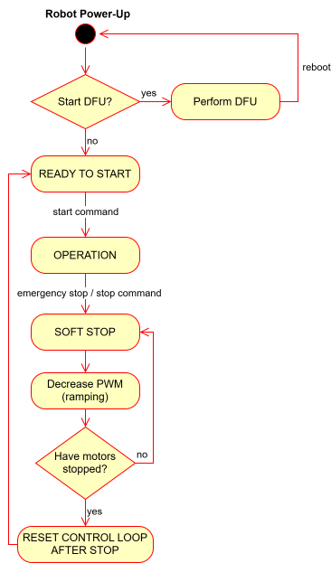

## Application State Machine structure

## States description
- **Perform DFU** – receives, verifies and loads new firmware. After a successful update, the robot reboots.
- **READY TO START** – waits for the start command. Until then, the robot is not balancing. 
- **OPERATION** – the main state in which the robot balances and receives driving and rotation commands.
- **SOFT STOP** – after an emergency or a regular stop command, PWM ramp-down to zero begins.
- **RESET CONTROL LOOP AFTER STOP** – resets the control loop and corresponding variables after stopping the robot.