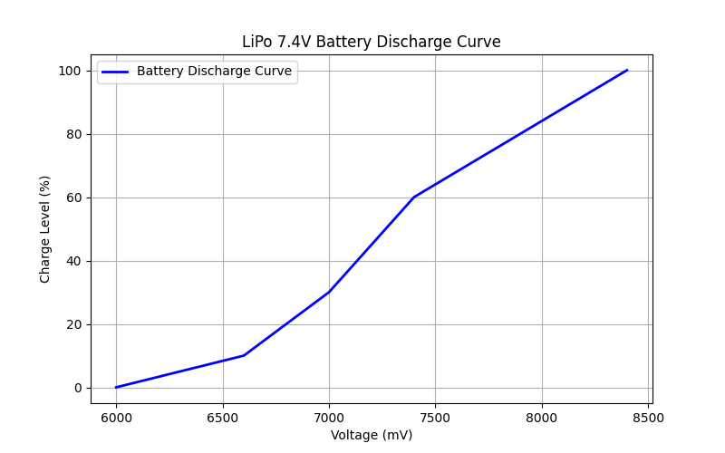

# LiPo 7.4V Battery Discharge Characteristics

This readme presents the discharge characteristics of a LiPo 7.4V battery and tests a function that calculates the battery charge level based on voltage.

## Battery Discharge Curve



The graph illustrates the relationship between the battery charge level (%) and voltage (mV).

## Testing the Charge Level Function


The test of the `battery_charge_level()` function shows how the charge level changes based on the input voltage.

## Scripts

All scripts are located in the `doc/scripts` directory:

- `**discharge_plot.py**` – Python script generating the battery discharge curve.
- `**battery_test.c**` – C script testing the function that calculates the battery charge level.

## How to Use?

### 1️⃣ Generate the Discharge Graph in Python

Run the `discharge_plot.py` script:

```
python3 discharge_plot.py
```

### 2️⃣ Test the Function in C

Copy the `battery_test.c` code to your compiler or run it online:

- Go to [Online GDB](https://www.onlinegdb.com/online_c_compiler)
- Paste the code
- Click “Run”